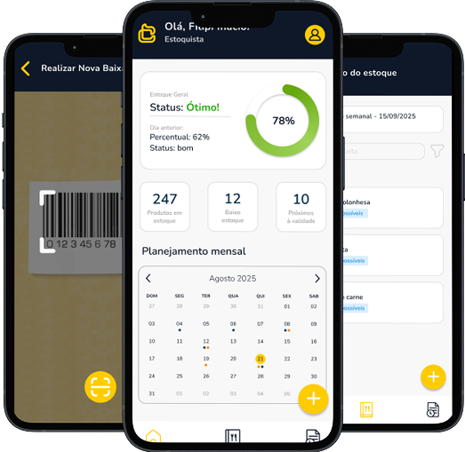

## Codcoz Web Cadastro

Aplicação web de cadastro construída com React 19 e Vite 7, integrada ao Firebase (Auth e Firestore). Este repositório contém o front-end da landing page de cadastro da Codcoz, com fluxo de inscrição simples e telas de sucesso.



### Tecnologias
- React 19
- Vite 7
- Firebase (Auth, Firestore)
- ESLint 9

---

## Requisitos
- Node.js 20+ (recomendado)
- npm 10+

## Instalação e uso
1. Instale as dependências:
   ```bash
   npm install
   ```
2. Ambiente de desenvolvimento (HMR):
   ```bash
   npm run dev
   ```
   O Vite exibirá a URL local (geralmente `http://localhost:5173`).
3. Build de produção:
   ```bash
   npm run build
   ```
   Os artefatos ficarão em `dist/`.
4. Visualizar o build localmente:
   ```bash
   npm run preview
   ```

## Scripts disponíveis
- `npm run dev`: inicia o servidor de desenvolvimento do Vite.
- `npm run build`: gera o build otimizado de produção.
- `npm run preview`: serve o build localmente para testes.
- `npm run lint`: executa o ESLint no projeto.

## Estrutura do projeto
```text
.
├─ dist/                 # build de produção (gerado)
├─ public/               # estáticos públicos
├─ src/
│  ├─ assets/            # imagens e ícones
│  ├─ components/        # componentes de UI (Header, Hero, SignUp, SuccessScreen)
│  ├─ firebase/          # configuração do Firebase
│  ├─ App.jsx            # composição principal
│  ├─ main.jsx           # bootstrap React/Vite
│  ├─ index.css          # estilos globais
│  └─ App.css            # estilos do App
├─ index.html            # HTML de entrada (Vite)
├─ package.json          # dependências e scripts
├─ vite.config.js        # config do Vite
├─ eslint.config.js      # regras do ESLint
├─ render.yaml           # configuração de deploy na Render
└─ README.md
```

## Firebase
O app usa Firebase para autenticação e base de dados. A configuração atual encontra-se em `src/firebase/config.js`.

Exemplo de configuração:
```js
const firebaseConfig = {
  apiKey: "...",
  authDomain: "...",
  projectId: "...",
  storageBucket: "...",
  messagingSenderId: "..."
};
```

Observações importantes:
- Para ambientes diferentes (dev/prod), recomenda-se mover os valores para variáveis de ambiente do Vite (`VITE_*`) e referenciá-las no código, evitando expor chaves diretamente no repositório.
- Consulte a documentação do Firebase para criar o projeto e habilitar os serviços necessários (Auth e Firestore).

## Componentes principais
- `Header`: topo da página com branding.
- `Hero`: seção de destaque da landing page.
- `SignUp`: formulário de cadastro e integração com Firebase.
- `SuccessScreen`: confirmação de sucesso após o cadastro.

## Qualidade de código
- ESLint já configurado. Para verificar possíveis problemas de estilo e estáticos:
  ```bash
  npm run lint
  ```

## Deploy
Este projeto inclui `render.yaml` para deploy na [Render](https://render.com). Fluxo geral:
1. Gerar o build: `npm run build` (ou configure o comando de build na Render).
2. Servir o conteúdo de `dist/` como site estático.

Alternativas: qualquer provedor estático (Vercel, Netlify, GitHub Pages) pode hospedar o conteúdo de `dist/`.

## Contribuição
1. Crie um branch a partir de `main`.
2. Faça commits atômicos e descritivos.
3. Abra um Pull Request descrevendo o contexto e as mudanças.

## Licença
Este projeto é distribuído sob a licença MIT. Consulte o arquivo LICENSE (se aplicável) ou inclua os termos no repositório.

